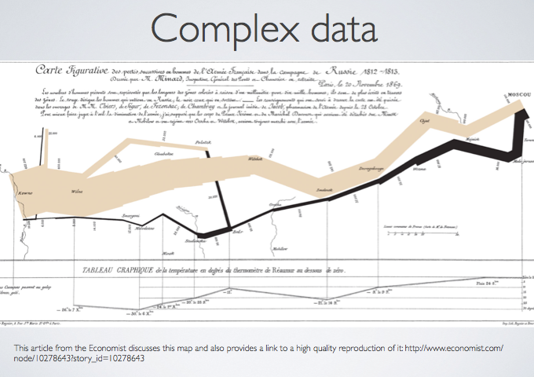

This workshop will explore how to visualize complex geographic data. While it is relatively straightforward to map one variable, working with multiple variables in a way that is visually comprehensible quickly becomes difficult. We will work with some complex data and discover strategies to deal with various types of data. This workshop will be most helpful for those with some ArcGIS for Desktop experience.

You can view the workshop instructions, presentation, and tutorial data [in the GitHub repository](https://github.com/clarkdatalabs/complex_mapping)
